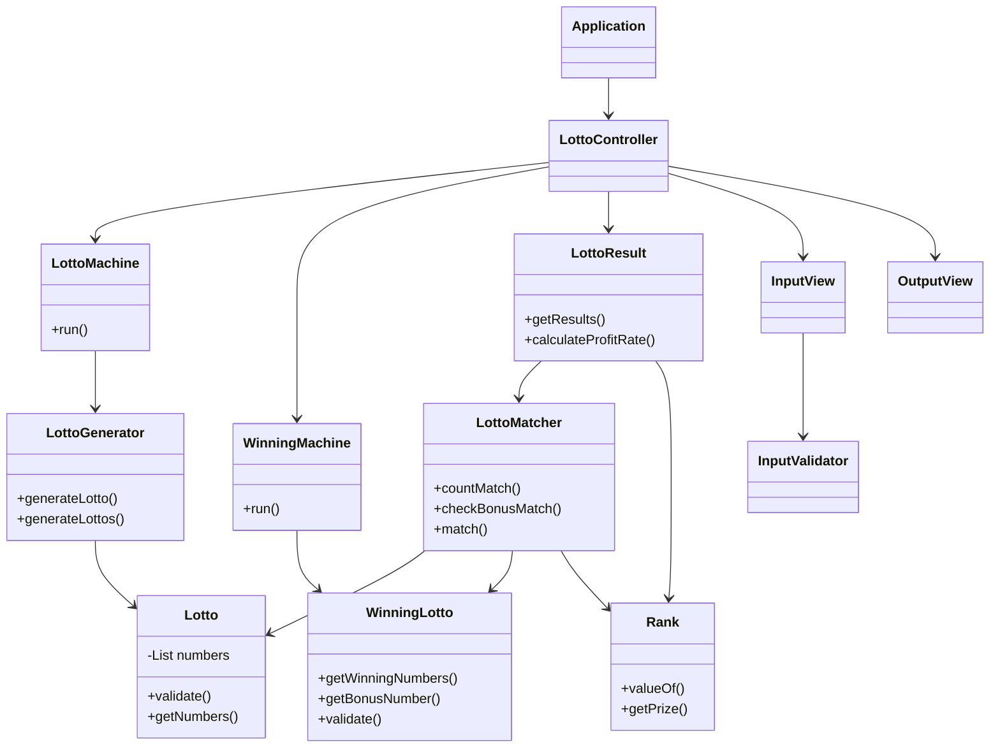

# java-lotto-precourse

## 요구사항 분석 (Requirement)

### 기능 요구사항
간단한 로또 발매기를 구현한다.
- 입력
    - 로또 구입 금액을 입력하면 구입 금액에 해당하는 만큼 로또를 발행한다.
    - 당첨 번호와 보너스 번호를 입력받는다. 
    - 사용자가 잘못된 값을 입력할 경우 IllegalArgumentException을 발생시킨다. 
    - 에러 발생 시, "[ERROR]"로 시작하는 에러 메시지를 출력 후 그 부분부터 입력을 다시 받는다.
- 로또
    - 로또 1장의 가격은 1,000원이다. 
    - 로또 번호의 숫자 범위는 1~45까지이다. 
    - 1개의 로또를 발행할 때 중복되지 않는 6개의 숫자를 뽑는다. 
    - 당첨 번호 추첨 시 중복되지 않는 숫자 6개와 보너스 번호 1개를 뽑는다. 
    - 사용자가 구매한 로또 번호와 당첨 번호를 비교하여 당첨 내역 및 수익률을 출력하고 로또 게임을 종료한다. 
    - 당첨 기준(당첨 기준 / 금액)
      - 1등: 6개 번호 일치 / 2,000,000,000원 
      - 2등: 5개 번호 + 보너스 번호 일치 / 30,000,000원 
      - 3등: 5개 번호 일치 / 1,500,000원 
      - 4등: 4개 번호 일치 / 50,000원 
      - 5등: 3개 번호 일치 / 5,000원
- 출력
    - 사용자가 구매한 로또 번호와 당첨 번호를 비교하여 당첨 내역 및 수익률을 출력하고 로또 게임을 종료한다.

### 예외 처리
- 사용자가 잘못된 값을 입력할 경우 IllegalArgumentException을 발생시킨다. 
- 에러 발생 시, "[ERROR]"로 시작하는 에러 메시지를 출력 후 그 부분부터 입력을 다시 받는다.

## 입출력 요구 사항
### 입력
로또 구입 금액을 입력 받는다. 구입 금액은 1,000원 단위로 입력 받으며 1,000원으로 나누어 떨어지지 않는 경우 예외 처리한다.
```
14000
```
당첨 번호를 입력 받는다. 번호는 쉼표(,)를 기준으로 구분한다.
```
1,2,3,4,5,6
```
보너스 번호를 입력 받는다.
```
7
```

### 출력
발행한 로또 수량 및 번호를 출력한다. 로또 번호는 오름차순으로 정렬하여 보여준다.
```
8개를 구매했습니다.
[8, 21, 23, 41, 42, 43] 
[3, 5, 11, 16, 32, 38] 
[7, 11, 16, 35, 36, 44] 
[1, 8, 11, 31, 41, 42] 
[13, 14, 16, 38, 42, 45] 
[7, 11, 30, 40, 42, 43] 
[2, 13, 22, 32, 38, 45] 
[1, 3, 5, 14, 22, 45]
```
당첨 내역을 출력한다.
```
3개 일치 (5,000원) - 1개
4개 일치 (50,000원) - 0개
5개 일치 (1,500,000원) - 0개
5개 일치, 보너스 볼 일치 (30,000,000원) - 0개
6개 일치 (2,000,000,000원) - 0개
```
수익률은 소수점 둘째 자리에서 반올림한다. (ex. 100.0%, 51.5%, 1,000,000.0%)
```
총 수익률은 62.5%입니다.
```
예외 상황 시 에러 문구를 출력해야 한다. 단, 에러 문구는 "[ERROR]"로 시작해야 한다.
```
[ERROR] 로또 번호는 1부터 45 사이의 숫자여야 합니다.
```

### 실행 결과 예시
```
구입금액을 입력해 주세요.
8000

8개를 구매했습니다.
[8, 21, 23, 41, 42, 43] 
[3, 5, 11, 16, 32, 38] 
[7, 11, 16, 35, 36, 44] 
[1, 8, 11, 31, 41, 42] 
[13, 14, 16, 38, 42, 45] 
[7, 11, 30, 40, 42, 43] 
[2, 13, 22, 32, 38, 45] 
[1, 3, 5, 14, 22, 45]

당첨 번호를 입력해 주세요.
1,2,3,4,5,6

보너스 번호를 입력해 주세요.
7

당첨 통계
---
3개 일치 (5,000원) - 1개
4개 일치 (50,000원) - 0개
5개 일치 (1,500,000원) - 0개
5개 일치, 보너스 볼 일치 (30,000,000원) - 0개
6개 일치 (2,000,000,000원) - 0개
총 수익률은 62.5%입니다.
```

## 프로그램 동작 흐름

1. 로또 구매 금액을 입력받는다.
2. 구매 금액을 기준으로 로또를 발행하고, 발행된 로또 수량과 번호를 출력한다.
3. 당첨 번호를 입력받는다.
4. 입력받은 당첨 번호를 쉼표(,) 기준으로 구분하여 파싱한다.
5. 보너스 번호를 입력받는다.
6. 구매한 각 로또와 당첨 번호를 비교하여 일치하는 번호 개수를 계산한다.
7. 일치 결과와 보너스 번호 여부를 기반으로 당첨 등수를 계산한다.
8. 전체 당첨 결과를 기반으로 수익률을 계산한다.
9. 로또 당첨 통계를 출력한다.


## 구현 전략

요구사항을 분석한 결과 프로그램의 핵심 요소는 **로또 번호 생성**, **당첨 번호 관리**, **입력과 출력 처리**라고 판단했다. 이에 따라 역할과 책임이 겹치지 않도록 기능을 기준으로 객체를 분리했다.

로또 관련 객체는 `Lotto` 접두어를 사용하여 명명하고, 당첨 번호와 관련된 객체는 `Winning` 접두어를 사용하여 명명했다.

특히 로또 발매 과정에서 **로또 생성과 발매 책임을 분리**하기 위해 로또 발매를 담당하는 `LottoMachine` 객체를 두고, 실제 번호 생성은 `LottoGenerator`가 담당하도록 설계했다.

- 로또
    - Lotto
    - LottoMachine
    - LottoGenerator
- 우승 로또
    - WinningLotto
    - WinningMachine
- 결과 확인
    - Rank
    - LottoMatcher
    - LottoResult
- 입력
    - InputView
    - InputValidator
- 출력
    - OutputView

## 예외 처리 전략
요구사항에 따라 사용자가 잘못된 값을 입력할 경우 `IllegalArgumentException`을 발생시키고 `[ERROR]`로 시작하는 메시지를 출력한 뒤, 해당 입력 단계부터 다시 입력을 받도록 구현했다.

### 구입 금액 입력 검증
- [ERROR] 로또 구매 금액은 숫자만 입력 가능합니다.
- [ERROR] 구입 금액은 1,000원 이상이어야 합니다.
- [ERROR] 구입 금액은 100,000원 미만이어야 합니다.
- [ERROR] 구입 금액은 1,000원 단위여야 합니다.

### 당첨 번호 입력 검증
- [ERROR] 당첨 번호 문자열은 숫자와 쉼표(,)만 입력 가능합니다.
- [ERROR] 당첨 번호는 6개여야 합니다.
- [ERROR] 당첨 번호는 중복될 수 없습니다.

### 보너스 번호 입력 검증
- [ERROR] 보너스 번호는 숫자만 입력 가능합니다.
- [ERROR] 보너스 번호는 1부터 45까지의 숫자만 입력 가능합니다.
- [ERROR] 보너스 번호는 당첨 번호와 중복될 수 없습니다.

### 로또 번호 검증
- [ERROR] 로또 번호는 6개여야 합니다.
- [ERROR] 로또 번호는 중복될 수 없습니다.


## 도메인 설계



### Application
프로그램의 시작부터 사용자 입력, 결과 출력, 종료까지 전체 실행 흐름을 담당한다.

### LottoController
로또 구매 프로그램의 전체 흐름을 제어하는 Controller이다.

#### 주요 메서드
- run() : 로또 구매 프로세스의 전체 흐름을 관리

### Lotto
구매한 로또 번호를 관리하는 도메인 객체이다.

#### 주요 메서드
- validate() : 로또 번호 유효성 검증
- getNumbers() : 로또 번호 반환

### LottoMachine
로또 구매 금액을 기반으로 로또 발매를 담당하는 도메인 서비스이다.

#### 주요 메서드
- run() : LottoGenerator를 실행하여 로또 번호 생성

### LottoGenerator
로또 번호를 생성하는 도메인 서비스이다.

#### 주요 메서드
- generateLotto() : 1부터 45 사이의 숫자 중 6개의 번호로 구성된 리스트 생성
- generateLottos() : 구매 금액에 해당하는 수량만큼 로또 번호 생성

### WinningLotto
당첨 로또 번호를 관리하는 도메인 객체이다.

#### 주요 메서드
- getWinningNumbers() : 입력값으로부터 당첨 번호 반환
- getBonusNumber() : 입력값으로부터 보너스 번호 반환
- validate() : 당첨 번호 입력값 유효성 검증

### WinningMachine
당첨 번호와 보너스 번호를 입력받아 당첨 로또 정보를 생성하는 도메인 서비스이다.

#### 주요 메서드
- run() : 당첨 로또 번호 생성

### LottoMatcher
구매한 로또 번호와 당첨 번호를 비교하는 도메인 서비스이다.

#### 주요 메서드
- countMatch() : 당첨 번호와 일치하는 번호 개수 계산
- checkBonusMatch() : 보너스 번호 일치 여부 확인
- match() : 일치 결과를 기반으로 당첨 등수 계산

### Rank
로또 당첨 등수와 상금 정보를 관리하는 Enum이다.

#### 주요 메서드
- valueOf() : 일치 개수에 해당하는 당첨 등수 반환
- getPrize() : 해당 등수의 당첨 상금 반환

### LottoResult
로또 당첨 결과를 집계하는 도메인 서비스이다.

#### 주요 메서드
- getResults() : 로또 당첨 결과 반환
- calculateProfitRate() : 로또 수익률 계산

### InputValidator
사용자 입력값 유효성을 검증한다.

#### 주요 메서드
- validateMoney() : 로또 구입 금액 유효성 검증
- validateWinningNumber() : 당첨 번호 유효성 검증
- validateBonusNumber() : 보너스 번호 유효성 검증
- parseNumbers() : 당첨 번호 문자열을 분리하여 정수 리스트로 변환

### InputView
사용자로부터 입력을 받는다.

#### 주요 메서드
- getMoney() : 구입 금액 입력
- getWinningNumbers() : 당첨 번호 입력
- getBonusNumber() : 보너스 번호 입력

### OutputView
로또 관련 메시지와 결과를 출력한다.

#### 주요 메서드
- printLottoNumbers() : 구매한 로또 번호 출력
- printResult() : 로또 결과 통계 출력

## 테스트

도메인 로직의 신뢰성을 검증하기 위해 각 클래스에 대한 단위 테스트와 통합 테스트를 작성했다.

- [ApplicationTest](https://github.com/zzzyoonnn/java-lotto-7-practice/blob/main/src/test/java/lotto/ApplicationTest.java) : 실제 입출력 흐름을 기반으로 로또 발매 전체 흐름을 검증하는 인수 테스트
- [LottoTest](https://github.com/zzzyoonnn/java-lotto-7-practice/blob/main/src/test/java/lotto/LottoTest.java) : 로또 생성 시 번호 유효성 검증에 대한 단위 테스트
- [InputValidatorTest](https://github.com/zzzyoonnn/java-lotto-7-practice/blob/main/src/test/java/lotto/domain/InputValidatorTest.java) : 사용자 입력값 검증에 대한 단위 테스트
- [LottoGeneratorTest](https://github.com/zzzyoonnn/java-lotto-7-practice/blob/main/src/test/java/lotto/domain/LottoGeneratorTest.java) : 로또 번호 생성 로직에 대한 단위 테스트
- [LottoResultTest](https://github.com/zzzyoonnn/java-lotto-7-practice/blob/main/src/test/java/lotto/domain/LottoResultTest.java) : 당첨 결과 집계 및 수익률 계산에 대한 통합 테스트
- [WinningLottoTest](https://github.com/zzzyoonnn/java-lotto-7-practice/blob/main/src/test/java/lotto/domain/WinningLottoTest.java) : 당첨 로또 번호 유효성 검증에 대한 단위 테스트


## 패키지 구조
```
├── main
│   └── java
│       └── lotto
│           ├── Application.java
│           ├── Lotto.java
│           ├── controller
│           │   └── LottoController.java
│           ├── domain
│           │   ├── InputValidator.java
│           │   ├── LottoGenerator.java
│           │   ├── LottoMachine.java
│           │   ├── LottoMatcher.java
│           │   ├── LottoResult.java
│           │   ├── Rank.java
│           │   ├── WinningLotto.java
│           │   └── WinningMachine.java
│           └── view
│               ├── InputView.java
│               └── OutputView.java
└── test
    └── java
        └── lotto
            ├── ApplicationTest.java
            ├── LottoTest.java
            └── domain
                ├── InputValidatorTest.java
                ├── LottoGeneratorTest.java
                ├── LottoResultTest.java
                └── WinningLottoTest.java

```
